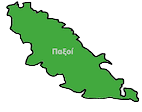

# PaxosAlgorithms Παξοί 

## Description
The present project specifies Paxos, Multi-Paxos and Vertical Paxos protocols in Alloy language. The reconfiguration protocol Vertical Paxos was modeled in its two variants, Vertical Paxos I and Vertical Paxos II. These protocols were specified in three different ways in order to explore different features of Alloy: static messages, dynamic messages and no messages. 

## How to Install the Project
* Install [Alloy](https://github.com/AlloyTools/org.alloytools.alloy);
* Clone this repository;
* Due to software copyright, this repository don't provide ***Java archive***, therefore you have to:
  - copy the following Java archives to the folder named jars:
    - log4j-api-2.2.jar
    - log4j-core-2.2.jar
    - log4j-api-2.3.jar
    - log4j-slf4j-impl-2.3.jar
    - org.alloytools.alloy.dist.jar
    - tla2tools.jar
 * For the same reason, you have to copy the following specifications to each TLA+ scope folder (PaxosAlgorithms/Scripts/TLA+/scopes/):
    - Consensus.tla
    - Paxos.tla
    - Votintg.tla
    - The three referred specifications are available at https://github.com/tlaplus/Examples/tree/master/specifications/Paxos

## How to Run the Project
* Use Alloy Analyzer's commands;
* You can load a theme created to capture events in the Alloy Analyzer. These have .thm extension;
  - Vertical Paxos variants share the same theme.
* You can also verify the safety property ***chosenValue*** through command-line running the executable run-script.sh;

## Experimental Results
* Different scopes, strategies and models were tested and their results are stored and can be seen in "PaxosAlgorithms/Plots/results";
* We also compared the performance of a safety property verification in Paxos written in two formal languages: Alloy and TLA+:
  - Scopes, startegies, solver and time of Alloy model can be found at "PaxosAlgorithms/Plots/results/electrodx/unbounded";
  - TLA+ specification for us used can be found at [TLA+](https://github.com/tlaplus/Examples/tree/master/specifications/Paxos);
  - Some TLA+'s scopes can be found at "PaxosAlgorithms/Scripts/TLA+/scopes" and can be exectuted through command-line. In order to do that, you must switch the working directory to TLA+'s directory and then execute run-script.sh. Remember that only two scopes are provided: "3 Acceptor, 3 Value, 3 Ballot and 2 Quorum" and "4 Acceptor, 3 Value, 3 Ballot and 3 Quorum". So if you want to run different tests, you need to modify the associated scope files and adjust their parameters.  
  - Run program plotBarUnbounded.py to observe our Alloy and TLA+ time results.
